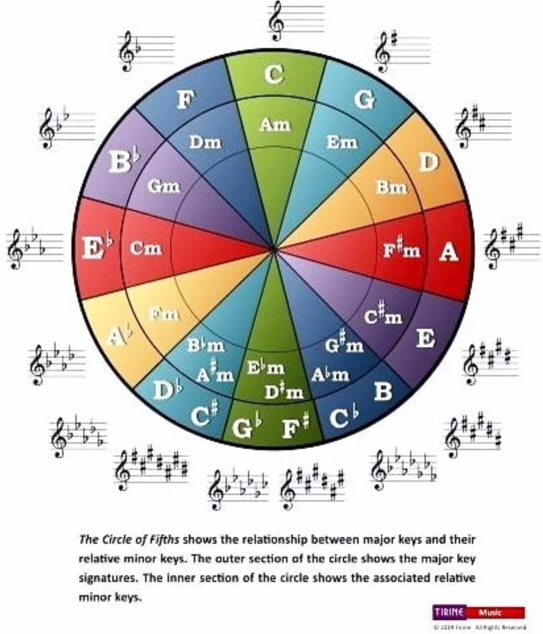

# Random notes

This section contains notes that I made that are either incompelte or not fully formatted and formulated out yet.

## Random older notes

Major:
- Major scale: W W H W W W H
- Major scale: Maj Min Min Maj Maj Min Dim
- Maj: Root/ Major 3rd/ Perfect 5th OR Root/ Major 3rd, on top of that Minor 3rd
- GMaj: Maj third (4 semitones) + minor third (three semi tones) --> Maj third + perfect fifth (7 semitones)
- AMin: Min third (4 semitones) + major third (three semi tones) --> Min third + perfect fifth (7 semitones)
- Maj7: Maj Chord as base, and 11 semitones/ one semitone below octave/ Maj third on top of perfect fifth

Minor:
- Minor scale: W H W W H W W
- Minor scale: Min Dim Maj Min Min Maj Maj
- Min: Root/ Minor 3rd/ Perfect 5th OR Root/ Minor 3rd, on top of that Major 3rd
- Min7: Min Chord as base, and 10 semitones/ two semitones below octave/ Min third on top of perfect fifth

Same pattern with Maj7 Min7 Min7 Maj7 7 Min7 Min7b5

Minor scale to relative major scale: 3rd note of minor scale because of the overflow over Locrian back to ionian

For every mode, find the relative major mode. Now, for that major mode, find the 3 minor chords. The minor pentatonics of those chords should sound OK over the original mode, depending on context

Major modes: Ionian/ Lydian/ Mixolydian
Minor modes: Aeolian/ Dorian/ Phrygian/ Locrian
--> Classified based on their 3rd scale degree: Only 3 semitones from root to 3rd note in scale for minor scales

e.g. Dim: Root/ Minor Third/ Dim Fifth (Six instead of 7 semitones) OR Root/ Minor 3rd/ Minor 3rd on top of Minor 3rd

e.g. Dim7: Diminished 7th above the root (9 semitones above the root) OR again Minor 3rd on top of last Minor 3rd // 3 semitones below octave
--> Only in harmonic minor scales

Min7b5: half-diminished
root + minor third + diminished fifth + minor seventh --> Diminished chord + minor 7th (10 semitones above root)/ two semitones below octave/ Min third on top of diminished fifth
---> Can only be constructed from diminshed chords on, meaning that key contains one or none?
---> Only in locrian as it is the 1st degree there? What about the other modes?

e.g. Dom7th chords: Major Chord base with flat 7th on top/ 2 semitones below octave of root --> 'simple' 7th chords
--> How important is Dom 7th? Only in Mixolydian/ for Mixolydian sound?

maj7#5: only harmonic minor
minmaj7: only harmonic minor

## Finding more chords fitting to mode-specific vamp

In order to find more chords here:
Take 4th & 5th chord of relative major scale + root of original scale in bass. Next, for those 2 major chords, find the 2 relativ minor chords (3 semitones below). Those will sound OK as well.
Additionally, take the chord that defines the sound of the scale:
- Ionian:      Major 3rd/ 7th         // 3rd and 7th scale degree
- Dorian:      Major 6th              // 6th scale degree
- Phrygian:    Flat 2nd scale degree  // 2nd scale degree
- Lydian:      Raised 4th             // 4th scale degree
- Mixolydian:  Flattened 7th          // 7th scale degree
- Aeolian:							// 6th?
- Locrian:     Flattened 5th  		// 5th scale degree

Does that mean a e.g. Phrygian chord progression should consist of 4th & 5th chord of relative major scale (--> 2 major chords making it 'Phrygian' with original root in bass) + second degree chords?
(thanks google, 2nd degree is lowered in phrygian) Question: (AbMaj is already the 2nd degree)?
e.g. in G Phrygian:
GMin/ AbMaj/ GMin/ BbMaj  // GMin/ FMin/ GMin/ GMin

Notes:   G     Ab     Bb     C     D       Eb     F   G
Chords:  GMin7 AbMaj7 BbDom7 CMin7 Dmin7b5 EbMaj7 FMin7

- Tonic (1st degree): The home note that gives the scale its identity and acts as a point of resolution.
- Supertonic (2nd degree): The note that creates movement away from the tonic.
- Mediant (3rd degree): Defines the scale's quality as major or minor.
- Subdominant (4th degree): Leads towards the dominant and creates tension that can resolve to the tonic.
- Dominant (5th degree): Creates strong tension that strongly pulls back to the tonic. It is a key note for creating resolution.
- Submediant (6th degree): Adds emotional depth and is often used in relative minor relationships.
- Leading tone (7th degree): A note a half step below the tonic that has a powerful pull to resolve to the tonic

Does that mean a e.g. Locrian chord progression should consist of 4th & 5th chord of relative major scale (--> 2 major chords making it 'Locrian' with original root in bass) + first degree chords?
(reasoning being is that the 1st degree is the diminished, which is quite unusual)
e.g. in G Locrian:
GDim/ DbMaj/ GDim/ EbMaj
GDim/ BbMin/ GDim/ CMin

Does that mean a e.g. Dorian chord progression should consist of 4th & 5th chord of relative major scale (--> 2 major chords making it 'Dorian' with original root in bass) + sixth degree chords?
e.g. in G Dorian:
Relative F Major scale : F  G  A  Bb  C  D  E  F
GMin/ BbMaj/ EDim/ CMaj
EDim/ GMin/ GMin/ AMin

Does that mean a e.g. Aeolian chord progression should consist of 4th & 5th chord of relative major scale (--> 2 major chords making it 'Aeolian' with original root in bass) + 1st degree chord?
e.g. in G Aeolian:
GMin/ EbMaj/ GMin/ FMaj

## Circle of fifths observations/ Relative minor & major keys

Relative Major/ Minor Keys:

--> You just have to look at the chords:
| Major Chords - Flat                                | Major Chords                                   | Major Chords - Sharp                              |
|----------------------------------------------------|------------------------------------------------|---------------------------------------------------|
| ----- SAME AS B MAJOR -----                        | CMaj: C - E  - G   --> (Em  - G)  relationship | C#Maj: C# - F  - G#  --> (Fm  - G#)  relationship |
| DbMaj: Db - F  - Ab   --> (Fm - Ab)   relationship | DMaj: D - F# - A   --> (F#m - A)  relationship | D#Maj: D# - G  - A#  --> (Gm  - A#)  relationship |
| EbMaj: Eb - G  - Bb   --> (Gm - Bb)   relationship | EMaj: E - G# - B   --> (G#m - B)  relationship | ----- SAME AS F MAJOR -----                       |
| ----- SAME AS E MAJOR -----                        | FMaj: F - A  - C   --> (Am  - C)  relationship | F#Maj: F# - A# - C#  --> (A#m - C#)  relationship |
| GbMaj: Gb - Bb - Db   --> (Bbm  - Db) relationship | GMaj: G - B  - D   --> (Bm  - D)  relationship | G#Maj: G# - C  - D#  --> (Cm  - D#)  relationship |
| AbMaj: Ab - C  - Eb   --> (Cm - Eb)   relationship | AMaj: A - C# - E   --> (C#m - E)  relationship | A#Maj: A# - D  - F   --> (Dm  - F)   relationship |
| BbMaj: Bb - D  - F    --> (Dm - F)    relationship | BMaj: B - D# - F#  --> (D#m - F#) relationship | ----- SAME AS C MAJOR -----                       |

---> music is in DbMinor, and the relative major is needed.
What Major Chord has 'D' as its 3rd? --> B - D# - F# --> realtive major to D# is F# --> Flatten twice --> Db <-> E

| Minor Chords      |
|-------------------|
| CMin: C - Eb  - G |
| DMin: D - F - A   |
| EMin: E - G - B   |
| FMin: F - Ab  - C |
| GMin: G - Bb  - D |
| AMin: A - C - E   |
| BMin: B - D - F#  |

Minor Chords = Major Chords with 3rd semitone down

## Trying to figure out all 7th chords in a key

G Major/ Ionian
Notes: G   A   B   C   D   E   F#   G
Dist:    W   W   H   W   W   W    H
Chords: GMaj  AMin  BMin  CMaj  DMaj  EMin  F#Dim
Chords: GMaj7 AMin7 BMin7 CMaj7 DDom7 EMin7 F#min7b5

Major:
- GMaj7: G Major: G  A  B  C  D  E  F#  G:  GBDF#:  in Key as 7th is F#: GBDF#
- CMaj7: C Major: C  D  E  F  G  A  B  C:   CEGB:   B is 1/2 semitone below octave & B is in G Major: Therefor in Key
- DMaj7: D Major: D  E  F#  G  A  B  C#  D: DF#AC#: C# not in G Major: Therefor not in key

Minor:
- AMin7: A Minor: A  B   C  D  E  F  G  A: ACEG:  G to A is whole tone, and G in G Major: In Key --> Rel Major Key: C Major: C  D  E  F  G  A  B  C: Start at A and build A + min third + perf fith + min 7th
- BMin7: B Minor: B  C#  D  E  F# G  A  B: BDF#A: A in G Major: In Key (Relative major key: C# Locrian -> D IONIAN/ MAJOR -> E Dorian -> ...)
- EMin7: E Minor: E  F#  G  A  B  C  D  E: EGBD:  D in G Major: In Key

---> F#Dim7: F#ACD#: D# not in G Major: not in key

---> DMaj7: DF#AC# --> DF#AC is in Key --> Maj7 with flat 7th --> D dominant 7th: In Key

---> F#m7b5: F#ACE: In Key

Example: G Ionian Style chord progression:
4 and 5 chord of major + with G in bass:

With CMaj: CEG
With DMaj: DF#A
---> F#m7b5 should fit in here, but does not really?

----------------------------------------------------------------------------------

G Dorian
Notes: G   A   Bb   C   D   E   F   G
Dist:    W   H    W   W   W   H   W
Chords: GMin  AMin  BbMaj  CMaj  DMin  EDim    FMaj
Chords: GMin7 AMin7 BbMaj7 CDom7 DMin7 Emin7b5 FMaj7

---> BbMaj7: Bb Major: Bb C  D  Eb  F   G   A  Bb: BbDFA: A is 1/2 semitone below octave & A is in G Dorian: Therefor in Key
---> CMaj7:  C Major:  C  D  E  F   G  A  B  C:    CEGB:  B not in G Dorian: Therefor not in key
---> FMaj7:  F Major:  F  G  A  Bb  C  D  E  F:    FACE:  E is in G Dorian: Therefor in Key       <--->  relative key        --> sounds better as arpeggio

---> GMin7: G Minor: G  A  Bb  C  D  Eb  F  G: GBbDF: F in G Dorian: In Key
---> AMin7: A Minor: A  B   C  D  E  F  G  A:  ACEG:  G in G Dorian: In Key
---> DMin7: D Minor: D  E  F  G  A  Bb  C  D:  DFAC:  C in G Dorian: In Key

---> EDim7: EGA#C#: C# not in G Dorian: not in key

---> CMaj7: CEGB --> CEGBb is in Key --> CDom7 in Key --> Why should this not be in Key?

Example: G Dorian Style chord progression:
4 and 5 chord of relative major + with G in bass: F Major (F G A Bb C D E F) Bb Major & C Major (Here a question: always 2 major chords, how to fill this up?)

With BbMaj: BbDF
With CMaj:  CEG
---> All notes from scale used except for A (--> why?)

----------------------------------------------------------------------------------
G Phrygian
Notes: G   Ab   Bb   C   D   Eb   F   G
Dist:    H    W    W   W   H    W   W
Chords: GMin  AbMaj  BbMaj  CMin  DDim    EbMaj  FMin
Chords: GMin7 AbMaj7 BbDom7 CMin7 Dmin7b5 EbMaj7 FMin7

---> AbMaj7: Ab Major: Ab  Bb C   Db   Eb  F   G  Ab: AbCEbG: G in G Phrygian: In Key
---> BbMaj7: Bb Major: Bb  C  D   Eb   F   G   A  Bb: BbDFA:  A not in G Phrygian: Therefor not in Key
---> EbMaj7: Eb Major: Eb  F  G   Ab   Bb  C   D  Eb: EbGBbD: D in G Phrygian: In Key       <--->  relative key        --> How to find this quicker?

---> GMin7: G Minor: G  A  Bb  C  D  Eb  F  G:   GBbDF:  F in G Phrygian: In Key   --> Why not?!
---> CMin7: C Minor: C  D  Eb  F  G  Ab  Bb  C:  CEbGBb: Bb in G Phrigian: In Key  --> Why not?!
---> FMin7: F Minor: F  G  Ab  Bb  C  Db  Eb  F: FAbCEb: Eb in G Phrigian: In Key

---> DDim7: DFG#B: B not in G Phrygian: not in key

---> BbMaj7: BbDFA --> BbDFAb: BbDom7 in Key  --> Why should this not be in Key?

Example: G Phrygian Style chord progression:
4 and 5 chord of relative major + with G in bass: Eb Major (Eb F G Ab Bb C D Eb) Ab Major & Bb Major

With AbMaj: AbCEb
With BbMaj: BbDF

----------------------------------------------------------------------------------

G Lydian
Notes: G   A   B   C#   D   E   F#   G
Dist:    W   W   W    H   W   W    H
Chords: GMaj  AMaj  BMin  C#Dim    DMaj  EMin  F#Min
Chords: GMaj7 ADom7 BMin7 C#min7b5 DMaj7 EMin7 F#Min7

---> GMaj7: G Major: G  A  B  C  D  E  F#  G:   GBDF#:  F# in G Lydian: In Key
---> AMaj7: A Major: A  B  C#  D  E  F#  G#  A: AC#EG#: G# not in key
---> DMaj7: D Major: D  E  F#  G  A  B  C#  D:  DF#AC#: C# in G Lydian: In Key      <--->  relative key

---> BMin7:  B Minor:  B   C#  D  E  F#  G  A  B:  BDF#A: A in G Lydian: In Key
---> EMin7:  E Minor:  E   F#  G  A  B   C  D  E:  EGBD:  D in G Lydian: In Key
---> F#Min7: F# Minor: F#  G#  A  B  C#  D  E  F#: F#AC#E E in G Lydian: In Key

---> C#Dim7: C#EGA#: A# not in G Lydian: not in key

---> AC#EG : ADom7 in Key  --> why should this not be in Key?!

Example: G Lydian Style chord progression:
4 and 5 chord of relative major + with G in bass: D Major (D E F# G A B C# D) G Major & A Major

With G: GBD
With A: AC#E

----------------------------------------------------------------------------------

G Mixolydian
Notes: G   A   B   C   D   E   F   G
Dist:    W   W   H   W   W   H   W
Chords: GMaj  AMin  BDim    CMaj  DMin  EMin  FMaj
Chords: GDom7 AMin7 Bmin7b5 CMaj7 DMin7 EMin7 FMaj7

---> GMaj7: G Major: G  A  B  C  D  E  F#  G: GBDF#: Not in Key as F# not in G Mixolydian
---> CMaj7: C Major: C  D  E  F  G  A  B  C:  CEGB:  B is 1/2 semitone below octave & B is in G Mixolydian: Therefor in Key       <--->  relative key
---> FMaj7: F Major: F  G  A  Bb  C  D  E  F: FACE:  E is in G Mixolydian: Therefor in Key

---> AMin7: A Minor:  A  B   C  D  E  F  G  A:   ACEG:  G in G Mixolydian: In Key
---> DMin7: D Minor:  D  E  F  G  A  Bb  C  D:   DFAC:  C in G Mixolydian: In Key
---> EMin7:  E Minor: E   F#  G  A  B   C  D  E: EGBD:  D in G Mixolydian: In Key

---> BDim7: BDFG#: G# not in G Mixolydian: not in key

---> GBDF: GDom7 in Key  --> In Key?!

Example: G Mixolydian Style chord progression:
4 and 5 chord of relative major + with G in bass: C Major (C D E F G A B C ) F Major & G Major

With F: FAC
With G: GBD

----------------------------------------------------------------------------------

G Aeolian
Notes: G   A   Bb   C   D   Eb   F   G
Dist:    W   H    W   W   H    W   W
Chords: GMin  ADim    BbMaj  CMin  DMin  EbMaj  FMaj
Chords: GMin7 Amin7b5 BbMaj7 CMin7 DMin7 EbMaj7 FDom7

---> BbMaj7: Bb Major: Bb  C  D   Eb   F   G   A  Bb: BbDFA:  A in G Aeolian: Therefor in Key       <--->  relative key
---> EbMaj7: Eb Major: Eb  F  G   Ab   Bb  C   D  Eb: EbGBbD: D in G Aeolian: In Key
---> FMaj7:  F Major:  F   G   A   Bb   C  D   E  F:  FACE:   E not in G Aeolian: Therefor not in Key

---> GMin7: G Minor: G  A  Bb  C  D  Eb  F  G:  GBbDF:  F in G Aeolian: In Key
---> CMin7: C Minor: C  D  Eb  F  G  Ab  Bb  C: CEbGBb: Bb in G Aeolian: In Key
---> DMin7: D Minor:  D  E  F  G  A  Bb  C  D:  DFAC:   C in G Aeolian: In Key    --> Why not?!
Why is an Em7 chord part of it?!

---> ADim7: ACD#F#: F# not in G Aeolian: not in key

Example: G Aeolian Style chord progression:
4 and 5 chord of relative major + with G in bass: Bb Major (Bb C D Eb F G A Bb ) Eb Major & F Major

With Eb: EbGBb
With F:  FAC

----------------------------------------------------------------------------------

G Locrian
Notes: G   Ab   Bb   C   Db   Eb   F   G
Dist:    H    W    W   H    W    W   W
Chords: GDim    AbMaj  BbMin  CMin  DbMaj  EbMaj  FMin
Chords: Gmin7b5 AbMaj7 BbMin7 CMin7 DbMaj7 EbDom7 FMin7

---> AbMaj7: Ab Major: Ab  Bb  C   Db   Eb  F   G  Ab: AbCEbG: G in G Locrian: In Key       <--->  relative key
---> DbMaj7: Db Major: Db  Eb  F  Gb  Ab  Bb  C  Db:   DbFAbC: C in G Locrian: In Key
---> EbMaj7: Eb Major: Eb  F  G   Ab   Bb  C   D  Eb:  EbGBbD: D not in G Locrian: Not in Key

---> BbMin7: Bb Minor: Bb C  Db  Eb  F  Gb  Ab  Bb: BbDbFAb: Ab in G Locrian: In Key  --> why not ?!
---> CMin7:  C Minor:  C  D  Eb  F   G  Ab  Bb  C:  CEbGBb:  Bb in G Locrian: In Key
---> FMin7:  F Minor:  F  G  Ab  Bb  C  Db  Eb  F:  FAbCEb:  Eb in G Locrian: In Key

---> GDim7: GA#C#E: E not in G Locrian: not in key

---> GA#C#F: Gm7b5

Example: G Locrian Style chord progression:
4 and 5 chord of relative major + with G in bass: Ab Major (Ab Bb C Db Eb F G Ab ) Db Major & Eb Major

With Db: DbFAb
With Eb: EbGBb

